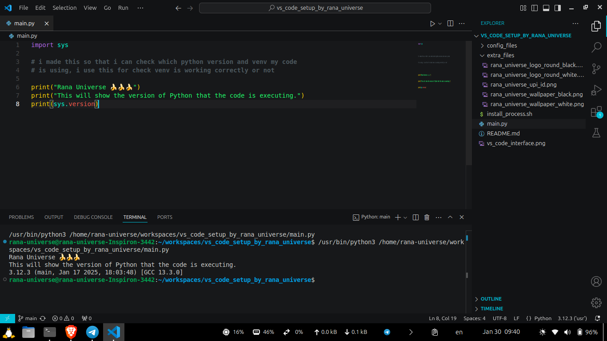

# VS Code Install with All Settings

### ```./install_process.sh```

Added This new short link to easily Clone This and use it to install vs code online latest...
### ```git clone https://github.com/RanaUniverse/v1```

This vs code installation is my own choice where i am keeping my own settings and themes and shortcuts so that i can easily use this script to install my vs code in any machine without much changes.




This will directly install vs code latest version and the extensions as required.

This need a Internet Connection to downoad the vs code and the extensions i want to use..

The main.py file is for checking python file.
